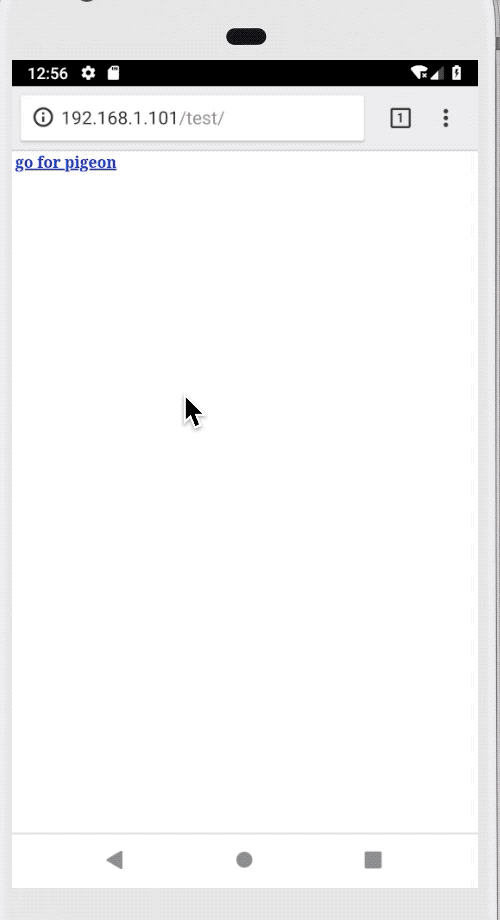

## Pigeon : 一个支持组件化开发和增量编译的路由框架

---

### Features

* Pigeon实现了activity间通过URL跳转和参数依赖注入，同时劫持了onActivityResult，改成接口回调
* Pigeon提供了基于特定uri规则的dispatch机制，用于支持互不依赖的module之间接口调用以及统一js调用Android入口
* Pigeon利用注解实现了IOC依赖注入，方便了IOC管理
* Pigeon没有使用APT，也没有使用反射，支持增量编译
* Pigeon支持Deep Link，从浏览器跳转应用任意页面

### usage

#### 1. 如何引用

##### 1.1 在project的build.gradle添加

```groovy
buildscript {
    dependencies {
        classpath 'xyz.bboylin:pigeon:0.1.2'
    }
}
```

##### 1.2 在app的build.gradle中添加

```groovy
// 注意，此项应该加在Android配置项后面，不然可能报错。
apply plugin: 'xyz.bboylin.pigeon'
```

##### 1.3 组件化项目在base module的build.gradle添加

```groovy
// 把 a b c替换成最新的release版本号
compile 'xyz.bboylin:pigeon-core:a.b.c'
```
非组件化项目则是直接在app module的build.gradle添加

#### 2. Activity路由使用

##### 2.1 使用注解标记要跳转的activity

```java
@RouteNode("pigeon://sample/SampleLibActivity")
public class SampleLibActivity extends BaseActivity {
    .......
}
```

##### 2.2 构造postcard跳转

```java
Postcard postcard = PostcardBuilder.newInstance(context, "pigeon://sample/SampleLibActivity")
                // 参数存储在bundle中，支持基本类型和parcelable类型
                .addExtra("demo", "this is demo string from pigeon postcard")
                .build();
Pigeon.setOff(postcard);
```

##### 2.3 参数的依赖注入

```java
    // 在要跳转的activity中使用Bind注解标记注入的字段
    @Bind("demo")
    String demoStr;

    @Override
    protected void onCreate(@Nullable Bundle savedInstanceState) {
        super.onCreate(savedInstanceState);
        // 手动调用参数注入，在BaseActivity中调用可一劳永逸
        Pigeon.inject(this);
    }
    ......
```

##### 2.4 onActivityResult改成接口回调

```java
setOff(@NonNull Postcard postcard, @NonNull OnResultListener onResultListener)

.......

public interface OnResultListener {
    void onResult(int resultCode, Intent data);
}
```

#### 3. Scheme Dispatch使用

##### 3.1 Pigeon基于一套Scheme规则进行分发：

```
// 规则
scheme://version/path?query
// 示例
pigeon://v99/broswer/loadUrl?from=MainActivity&showConfirm=1&params={"url":"http%3a%2f%2fbboylin.github.io%2f"}
```

其中version部分遵循正则：v\d+ 数字越大表示版本越高，path部分可自由组合，建议按照module/submodule/...../action这种细分。query部分的key和value在dispatch到对应的dispatcher的时候会进行url decode，同时以hashmap形式提供。

##### 3.2 可通过注解为Pigeon添加Dispatcher和Interceptor , 使用注解好处在方便组件间解耦：

```java
// 每个Dispatcher都有个对应的path，uri dispatch的时候会解析出path，根据path找到对应Dispatcher
@Dispatcher(path = "browser/loadUrl")
public class WebDispatcher extends AbstractSchemeDispatcher {

    @Override
    public boolean invoke(@NonNull Context context, @NonNull Query query, @Nullable PigeonDispatchCallback callback) {
        .......
    }
}

.......

// 可指定index，因为某些场景下对interceptor顺序有要求
@Interceptor(index = 0)
public class DemoInterceptor extends AbstractSchemeInterceptor {
    @NonNull
    @Override
    public String getName() {
        return "DemoInterceptor";
    }

    @Override
    public boolean shouldInterceptSchemeDispatch(@NonNull Context context, @NonNull String scheme) {
        Log.d(getName(), "shouldInterceptSchemeDispatch");
        // 当返回false的时候会继续用其他interceptor尝试拦截，返回true不再进行dispatch
        // 所有interceptor都不拦截的情况下会交给对应dispatcher处理
        return false;
    }
}
```

##### 3.3 在应用启动的时候Pigeon需要初始化：

```java
// 初始化的时候可以绑定dispatcher和interceptor，以及校验scheme有效性等。
// 无特殊要求的话init时候可以传null
Pigeon.init(new SchemeConfig() {
    @Nullable
    @Override
    public List<AbstractSchemeInterceptor> getInterceptors() {
        return null;
    }

    @Nullable
    @Override
    public Map<String, AbstractSchemeDispatcher> getDispatchers() {
        return null;


    @Override
    public boolean checkValidScheme(@NonNull SchemeEntity entity) {
        return TextUtils.equals(entity.schemeHead, "pigeon") && entity.version >= CURRENT_VERSION;
    }
});
// 可以选择是否开启pigeon的debug模式
Pigeon.openDebug();
```

##### 3.4 分发的时候使用dispatch方法即可:

```java
public static boolean dispatch(@NonNull Context context, @NonNull String uri);
public static boolean dispatch(@NonNull Context context, @NonNull String uri, @Nullable PigeonDispatchCallback callback);
```

#### 4. IOC依赖注入

通过Autowired和Inject两个注解，示例：

```java
@Autowired
public class AppRuntimeProvider {
    // 注入的目标类以及是否使用单例模式
    @Inject(target = "xyz.bboylin.demo.AppRuntime", singleton = true)
    public static IAppRuntime get() {
        return null;
    }
}
```

其中xyz.bboylin.demo.AppRuntime是要注入的实现类，其实现了接口IAppRuntime。

在最终生成的APK里，这段代码会变成：

```java
@Autowired
public class AppRuntimeProvider {
    public AppRuntimeProvider() {
    }

    // singleton = true会生成工厂类提供AppRuntime这个类的单例，否则直接new创建实例
    @Inject(
        target = "xyz.bboylin.demo.AppRuntime",
        singleton = true
    )
    public static IAppRuntime get() {
        return AppRuntime_Factory.get();
    }
}
```

#### Principle

##### 5.1 why not apt

一是因为gradle 4.7才开始部分支持apt的增量编译，二是因为apt一次只能对单个module生效，最后还得需要开发一个gradle插件合并所有module的路由表。

基于此，pigeon直接利用javassist在transform阶段生成路由表，一举两得。

##### 5.2 about IOC

组件化开发中，有时候会出现下层module需要调用上层module接口的现象，例如获取App Context；例如调用登陆，视频播放等功能，而这几个功能在上层module。

这时候就需要进行控制反转。不使用依赖注入的话，控制反转也能完成，但是需要手动写一些公式化的代码替代依赖注入，而且需要注意注入的时机。

##### 5.3 about scheme

好处一是方便调用不依赖的module的服务，方便组件之间解耦；二是可以统一js和Android通信的桥梁，只需要绑定一个方法，根据传入的不同scheme就能调用不同服务。这个分发过程已经由pigeon完成，

##### 5.4 about RouteMap

路由表是在transform阶段扫描RouteNode注解生成，activity内参数注入通过扫描Bind注解，针对每个activity生成对应的Injector类，最终生成一个InjectorDispatcher类根据要跳转的activity名找到对应Injector来执行参数注入。

具体用法可以参考demo代码。



## License

    Copyright 2019 bboylin

    Licensed under the Apache License, Version 2.0 (the "License");
    you may not use this file except in compliance with the License.
    You may obtain a copy of the License at

       http://www.apache.org/licenses/LICENSE-2.0

    Unless required by applicable law or agreed to in writing, software
    distributed under the License is distributed on an "AS IS" BASIS,
    WITHOUT WARRANTIES OR CONDITIONS OF ANY KIND, either express or implied.
    See the License for the specific language governing permissions and
    limitations under the License.

